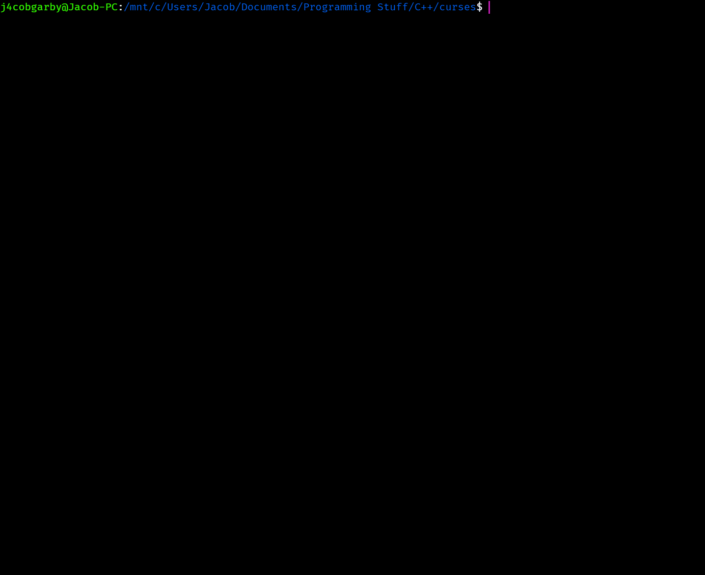

## Getting started (downloading executable)

If you simply want to quickly have a look at eddy, you can download the most recent binary from [releases](https://github.com/j4cobgarby/eddy/releases), but note that these aren't entirely up to date with the commits, and since they've all been built on an ubuntu subsystem on Windows, they won't necessarily work on your computer. In most cases, it's better to build the program yourself for the time being.

## Getting Started (development)

Want to develop or test eddy? Follow these instructions to do so!

### Quick version

```
sudo apt-get install libncurses5-dev libncursesw5-dev
git clone https://github.com/j4cobgarby/eddy
cd eddy
make
./eddy
```

### Prerequisites

 - Preferrably UNIX like OS (e.g. Linux, MacOS, **However, Windows users can use this too, with extra steps**)
 - ncurses
 - g++

#### Debian (or Debian based distros e.g. ubuntu)

```
sudo apt-get update
sudo apt-get install libncurses5-dev libncursesw5-dev
```
And if you don't already have g++
```
sudo apt-get install g++
```

#### Other linux systems, or MacOS

 - [Debian, centos, fedora](https://www.cyberciti.biz/faq/linux-install-ncurses-library-headers-on-debian-ubuntu-centos-fedora/)
 - MacOS
 ```
 brew install curses
 ```

#### Windows

The best way to get started on Windows is by installing the Windows subsystem for Linux. Basically this is
a way of opening up an ubuntu shell in Windows! You can find out more about that
[here](https://msdn.microsoft.com/en-gb/commandline/wsl/install_guide), but

> Your PC must be running a 64-bit version of Windows 10 Anniversary Update or later (build 1607+).

Once you've got the bash shell up and running, you can follow the steps for debian

### Installing for development

Now you're ready to get the development environment set up!

Run these commands in your terminal

```
git clone https://github.com/j4cobgarby/eddy

cd path/to/repository/root

make clean

make
```

Now you can simply run it

```
./eddy
```

## Built With

* g++ - The c++ compiler
* [ncurses](http://invisible-island.net/ncurses/man/ncurses.3x.html) - To do graphical stuff in a terminal

## Contributing

 1. Fork it
 2. Create a new branch for your new feature
 3. Develop this branch - comment (briefly or in detail) how it all works
 4. Make sure you've changed all the necessary bits and pieces to reflect the new version. These are
   - In `main.cpp`: the title bar's text, and the title of the splash dialog.
   - Made relevant changed to `README.md` (commands, etc..)
 5. Push your fork

## How to use

Similar to vim, eddy has different modes for editing files. eddy has two modes:

 - `NORMAL`
 - `INSERT`

### NORMAL mode

When you open up eddy, you'll be in `NORMAL`. This is the mode in which you can make use of eddy's
different commands. To switch from `NORMAL` to `INSERT`, simply press `i`.

### INSERT mode

Once you're in `INSERT`, you can start writing text in the file. You may enter text just as in any
other editor. When you want to go back into `NORMAL`, press `escape`.

### NORMAL mode commands

|Key|Action|Notes|
|---|---|---|
|`x`|Quits eddy|Doesn't prompt to save. Make sure you've already saved if you want to keep what you've done.|
|`s`|Saves the current file|If you're not editing a file and instead writing a new file from scratch, eddy will open a dialog box asking for you to name your new file.|
|`i`|Enters insert mode.||
|`[`|Scroll up by one character.|You can of course scroll normally by getting near to the bottom or top of the viewport using the arrow keys.|
|`]`|Scroll down by one character.|See above.|
|`{`|Scroll up by 10 characters.||
|`}`|Scroll down by 10 characters.||
|`f`|Find and replace|The find field takes a regex, but you can find a simple word too. Also, in the replace field, you can include things such as $1 or $2 to get capture groups from the regex.|
|`o`|Opens a file from a given path.|You're prompted to write the path in a dialog box. If you write nothing, or something which can't be a filename, the file will be named untitled once saved.|
|`O`|Opens a file from a URL on the internet.|Note that you must type a _capital_ O. You obviously need internet for this to work.|

### Opening files

You can open files in many different ways:

 - Local file, from command line

```
eddy path/to/file
```

 - Local file, from eddy

 Press `o` when in `NORMAL` mode.

 - File from URL, from eddy

 Press `O` when in `NORMAL` mode.

*Note at the moment, file paths can't include spaces. This is a known issue.*

### Creating new files

You can create a new file the same way you'd open one which already exists. Suppose you want to create a file called `new_file.txt`, you could do this

```
eddy new_file.txt
```

And then, once it's loaded, press `s` to create it.

Alternatively you could rely on your operating system's commands

```
touch new_file.txt
eddy new_file.txt
```

or something like that. If that doesn't work, you could always do

```
echo> new_file.txt
eddy new_file.txt
```

## Authors

* **Jacob Garby** - *Initial development* - [j4cobgarby](https://github.com/j4cobgarby)

See also the list of [contributors](https://github.com/j4cobgarby/eddy/contributors) who participated in this project.
